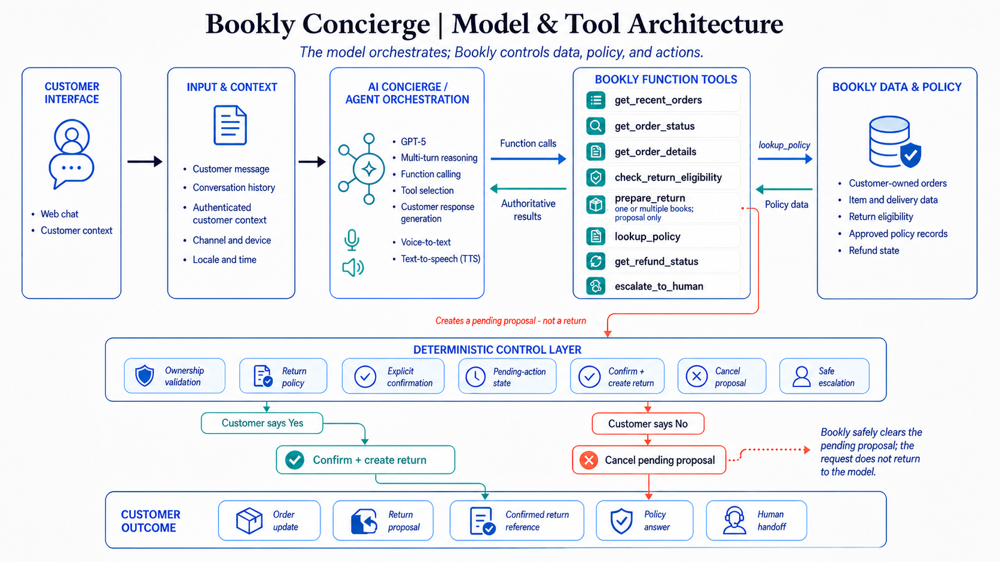

# Bookly Concierge

AI customer-support concierge for Bookly, built for the Decagon Solutions Engineering take-home.

## Demo

[Live demo (Vercel)](https://your-bookly-concierge.vercel.app) - replace this URL after deployment.

Bookly Concierge supports:

- Order status
- Returns with clarification and explicit confirmation
- Policy questions
- Human escalation for unverified outcomes
- Text and voice conversations

The primary demo path is: sign in as Sarah Chen, ask about the latest order, request a return, select `Wolf Hall`, and explicitly confirm the proposal. Ask about an unverified refund to see the escalation path.

### Suggested Review Order

1. Run the app and follow the primary demo path above.
2. Review the architecture diagram and the constrained tool surface.
3. Follow the return boundary from prompt to tool implementation to deterministic guardrails.
4. Run the focused tests and adversarial evaluation cases.

## Quick Start

```bash
npm install
cp .env.example .env.local
npm run dev
```

Required in `.env.local`:

```bash
OPENAI_API_KEY=your_key_here
```

Optionally set `OPENAI_MODEL`; it defaults to `gpt-5`. Open [http://localhost:3000](http://localhost:3000).

## Architecture



### Architecture Principle

**The model orchestrates; Bookly controls data, policy, and actions.**

OpenAI understands intent, continues the conversation, selects from a constrained tool set, and generates the customer-facing response. The Bookly application owns customer identity, retrieves data and policy, enforces business rules, holds pending state, executes approved actions, and creates human handoffs.

The exact [Responses API prompt](./lib/agent/bookly-concierge.ts#L153), [strict function schemas](./lib/agent/bookly-concierge.ts#L33), and [tool-call orchestrator](./lib/agent/bookly-concierge.ts) are kept in source so a reviewer can inspect the agent contract directly.

## Agent Flow

```text
User
  -> chat or voice
  -> OpenAI Responses agent
  -> function call
  -> Bookly tool
  -> deterministic validation
  -> tool result
  -> agent response
```

Conversation continuity uses the Responses API `previous_response_id`. Authorization and transactional state remain in Bookly-owned session and pending-action state, rather than in model-generated arguments.

## Tools

| Tool | Purpose |
| --- | --- |
| `get_recent_orders` | Retrieve the authenticated customer's orders. |
| `get_order_status` | Check authoritative delivery or fulfillment status. |
| `get_order_details` | Retrieve order items and delivery details. |
| `check_return_eligibility` | Validate ownership, return rules, refund amount, and deadline. |
| `prepare_return` | Create a pending proposal for one eligible item. |
| `prepare_returns` | Create one pending proposal for multiple eligible items from the same order. |
| `lookup_policy` | Retrieve an approved Bookly policy answer. |
| `get_refund_status` | Check the refund state for a customer-owned order. |
| `escalate_to_human` | Create a contextual support handoff. |

The full model-accessible tool surface is defined in [`bookly-concierge.ts`](./lib/agent/bookly-concierge.ts#L33); the deterministic implementations are in [`bookly-tools.ts`](./lib/tools/bookly-tools.ts).

## Safe Actions

```text
prepare_return
  -> pending proposal
  -> explicit customer confirmation
     -> yes: confirm and create return
     -> no:  cancel proposal
```

The model cannot directly create a return. `prepare_return` validates the authenticated customer's ownership and the item's eligibility, then creates a pending action. The application recognizes a narrow set of explicit confirmations and only then calls the application-only `confirmReturn` and `createReturn` operations.

Inspect the [confirmation resolver](./lib/agent/bookly-concierge.ts#L345), [eligibility and return implementation](./lib/tools/bookly-tools.ts#L149), and [pending-action state machine](./lib/guardrails/return-actions.ts#L54) to follow this boundary end to end.

## Grounding And Policy

The prototype uses structured Bookly policy data rather than RAG. This is deliberate: the policy set is small and controlled, so semantic retrieval would add complexity without meaningful benefit. `lookup_policy` is an abstraction boundary that can be backed by production search or retrieval as Bookly's knowledge base grows.

## Customer Identity And Authorization

Customer identity comes from the authenticated Bookly session, never from a model-generated customer ID. Tools enforce customer ownership before returning order data or performing an action. The relevant [session implementation](./lib/session/session.ts), [order ownership check](./lib/tools/bookly-tools.ts#L62), and [pending-action ownership check](./lib/guardrails/return-actions.ts#L37) are linked for review.

## Voice

```text
Microphone -> speech-to-text -> same Bookly agent -> text response -> text-to-speech
```

Text and voice share the same agent, tools, guardrails, and conversation logic.

## Evaluation

Key scenarios covered by the test suite:

- Latest-order lookup
- Ambiguous return leading to clarification
- Eligible return proposal and confirmation
- Return attempt without confirmation
- Expired or ineligible return
- Cross-customer order and action access
- Policy question grounding
- Refund escalation
- Tool failures and confirmation-bypass attempts

Run the checks with:

```bash
npm run lint
npm run typecheck
npm test
npm run evals
npm run build
```

See the [concierge tests](./tests/bookly-concierge.test.ts), [return guardrail tests](./tests/return-guardrails.test.ts), and [functional/adversarial evals](./tests/bookly-evals.test.ts).

## What I Would Change In Production

| Prototype | Production |
| --- | --- |
| Mock customer data | Bookly customer APIs |
| Mock orders and returns | Order-management system |
| Structured policies | Production knowledge source |
| Mock authentication | Production identity and authorization |
| Local trace store | Central observability and audit trail |
| Small evaluation set | Continuous evaluation from support data |
| Mock escalation | Support-platform integration |

The mock data and in-memory state reset when the development server restarts. The existing tool and guardrail boundaries are intended to let production integrations replace the local implementations without changing the agent's safety model.
